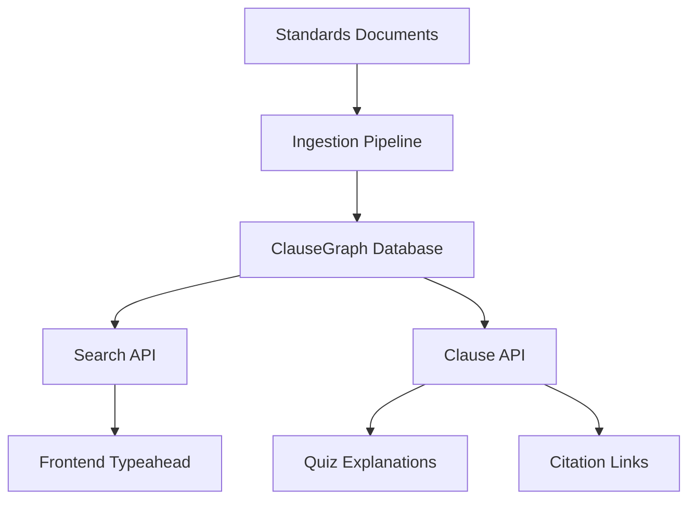

# ClauseGraph v0 Overview

## Vision

ClauseGraph is ClauseBot's knowledge graph engine for welding standards and codes. It provides structured, searchable, and verifiable access to clause-level content from AWS D1.1, ASME IX, API 1104, and other standards.

## Architecture



## Database Schema

### Core Tables

```sql
-- Standards registry
CREATE TABLE standards (
    id UUID PRIMARY KEY,
    code VARCHAR(50) NOT NULL,        -- "AWS", "ASME", "API"
    title VARCHAR(200) NOT NULL,      -- "AWS D1.1:2025"
    version VARCHAR(50) NOT NULL,     -- "2025"
    effective_date DATE,
    status VARCHAR(20) DEFAULT 'active'
);

-- Individual clauses
CREATE TABLE clauses (
    id UUID PRIMARY KEY,
    standard_id UUID REFERENCES standards(id),
    reference VARCHAR(100) NOT NULL,  -- "5.6.1", "QW-200"
    title VARCHAR(500),
    content TEXT NOT NULL,
    parent_ref VARCHAR(100),          -- For hierarchical clauses
    section_type VARCHAR(50),         -- "requirement", "definition", "procedure"
    created_at TIMESTAMP DEFAULT NOW(),
    updated_at TIMESTAMP DEFAULT NOW()
);

-- Cross-references between clauses
CREATE TABLE crosswalks (
    id UUID PRIMARY KEY,
    source_clause_id UUID REFERENCES clauses(id),
    target_clause_id UUID REFERENCES clauses(id),
    relationship_type VARCHAR(50),    -- "references", "supersedes", "clarifies"
    confidence DECIMAL(3,2),          -- 0.0-1.0 confidence score
    verified_by VARCHAR(100),         -- SME who verified this link
    verified_at TIMESTAMP
);

-- Verification and provenance
CREATE TABLE verifications (
    id UUID PRIMARY KEY,
    clause_id UUID REFERENCES clauses(id),
    verifier_id VARCHAR(100) NOT NULL,
    verification_type VARCHAR(50),    -- "content", "citation", "interpretation"
    status VARCHAR(20),               -- "verified", "disputed", "pending"
    notes TEXT,
    verified_at TIMESTAMP DEFAULT NOW()
);
```

## API Endpoints

### Search API
```
GET /v1/clausegraph/search
Query Parameters:
  - q: search query (required)
  - standard: filter by standard code (optional)
  - section_type: filter by section type (optional)
  - limit: max results (default: 10, max: 50)
  - verified_only: only verified clauses (default: false)

Response:
{
  "query": "fillet weld",
  "results": [
    {
      "clause_id": "uuid",
      "standard": "AWS D1.1:2025",
      "reference": "2.3.1",
      "title": "Fillet Weld Definition",
      "snippet": "A weld of approximately triangular cross section...",
      "relevance_score": 0.95,
      "verification_status": "verified"
    }
  ],
  "total": 15,
  "took_ms": 45
}
```

### Clause Detail API
```
GET /v1/clausegraph/clause/{standard}/{reference}
Example: /v1/clausegraph/clause/AWS/5.6.1

Response:
{
  "clause": {
    "id": "uuid",
    "standard": "AWS D1.1:2025",
    "reference": "5.6.1", 
    "title": "Fillet Weld Size",
    "content": "The size of a fillet weld...",
    "section_type": "requirement",
    "parent_reference": "5.6",
    "verification_status": "verified"
  },
  "crosswalks": [
    {
      "target_standard": "ASME IX",
      "target_reference": "QW-200.1",
      "relationship": "references",
      "confidence": 0.88
    }
  ],
  "related_clauses": [
    {
      "reference": "5.6.2",
      "title": "Effective Throat Thickness",
      "relationship": "follows"
    }
  ]
}
```

### Admin Verification API
```
POST /v1/clausegraph/verify
Authorization: Bearer {admin_token}

Request:
{
  "clause_id": "uuid",
  "verification_type": "content",
  "status": "verified",
  "notes": "Reviewed against AWS D1.1:2025 print edition"
}

Response:
{
  "verification_id": "uuid",
  "status": "verified",
  "verified_at": "2025-11-15T10:30:00Z"
}
```

## Ingestion Pipeline

### Phase 1: AWS D1.1:2025 Subset
Target clauses for initial ingestion:
- **Section 2**: Definitions (2.1-2.8)
- **Section 3**: General Requirements (3.1-3.7) 
- **Section 5**: Workmanship (5.1-5.30)
- **Section 6**: Inspection (6.1-6.15)

### Ingestion Process
```python
# Pseudo-code for ingestion
def ingest_standard(standard_code, version, source_file):
    # 1. Parse document structure
    sections = parse_document(source_file)
    
    # 2. Extract clauses with hierarchy
    for section in sections:
        clauses = extract_clauses(section)
        
        # 3. Store in database
        for clause in clauses:
            store_clause(
                standard=standard_code,
                reference=clause.reference,
                title=clause.title,
                content=clause.content,
                parent_ref=clause.parent
            )
    
    # 4. Generate cross-references
    generate_crosswalks(standard_code, version)
    
    # 5. Mark for verification
    queue_for_verification(standard_code, version)
```

## Integration Points

### Quiz System
```typescript
// In quiz explanations
const QuizExplanation = ({ explanation, clauseRef }) => {
  return (
    <div>
      <p>{explanation}</p>
      {clauseRef && (
        <ClauseCitation 
          reference={clauseRef}
          standard="AWS D1.1:2025"
        />
      )}
    </div>
  );
};
```

### Frontend Typeahead
```typescript
// Clause reference lookup
const ClauseSearch = () => {
  const [query, setQuery] = useState('');
  const { data: results } = useClauseSearch(query);
  
  return (
    <Combobox>
      {results?.map(clause => (
        <ComboboxOption key={clause.id} value={clause.reference}>
          {clause.standard} {clause.reference}: {clause.title}
        </ComboboxOption>
      ))}
    </Combobox>
  );
};
```

## Success Metrics

### Technical
- **Search Latency**: P95 < 200ms
- **Ingestion Rate**: 1000 clauses/hour
- **Index Size**: < 500MB for full AWS D1.1
- **API Uptime**: 99.9%

### Content Quality
- **Verification Rate**: 80% of clauses verified by SMEs
- **Cross-reference Accuracy**: 90% confidence threshold
- **Search Relevance**: 85% user satisfaction (manual testing)
- **Citation Completeness**: 95% of quiz questions have clause refs

## Roadmap

### v0.1 (Nov 17-24)
- [ ] Database schema & migrations
- [ ] Basic ingestion pipeline
- [ ] Search API (text-based)
- [ ] Clause detail API
- [ ] Admin verification endpoint

### v0.2 (Nov 25 - Dec 1)
- [ ] AWS D1.1:2025 subset ingested
- [ ] Frontend typeahead component
- [ ] Quiz integration (clause citations)
- [ ] Basic cross-references

### v0.3 (Dec 2-8)
- [ ] Full-text search optimization
- [ ] Semantic search (embeddings)
- [ ] Cross-standard references
- [ ] Verification workflow UI

### v1.0 (Q1 2026)
- [ ] Multiple standards support
- [ ] Advanced search filters
- [ ] Collaborative verification
- [ ] Public API access

## Security & Compliance

### Access Control
- **Public APIs**: Read-only access to verified content
- **Admin APIs**: JWT-based authentication
- **Rate Limiting**: 100 requests/minute per IP
- **Audit Logging**: All verification actions logged

### Data Integrity
- **Checksums**: Content integrity verification
- **Versioning**: Track changes to clause content
- **Backup**: Daily automated backups
- **Disaster Recovery**: Cross-region replication

## Deployment

### Database
- **Primary**: PostgreSQL 15+ with full-text search
- **Caching**: Redis for search results
- **Hosting**: Supabase or dedicated RDS instance

### API Services
- **Framework**: FastAPI (Python) or Express (Node.js)
- **Hosting**: Render or Vercel Functions
- **CDN**: CloudFlare for static assets

### Monitoring
- **Metrics**: Search latency, ingestion rate, error rates
- **Alerts**: API downtime, verification queue backlog
- **Dashboards**: Grafana or built-in monitoring

---

**Last Updated**: October 25, 2025  
**Status**: Planning Phase  
**Target Launch**: November 17, 2025  
**Owner**: Development Team
