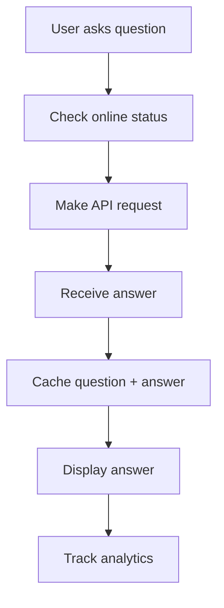
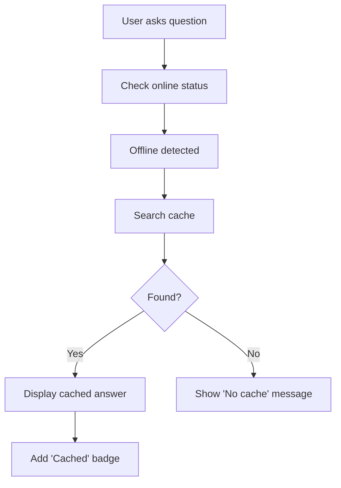
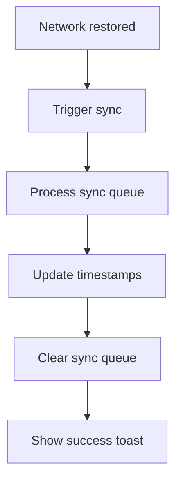

# Progressive Web App (PWA) Documentation

Comprehensive guide to ClauseBot.Ai's Progressive Web App features, offline capabilities, and installation.

## 📱 Overview

ClauseBot.Ai is built as a Progressive Web App (PWA), providing a native app-like experience directly in the browser with full offline support.

### Why PWA?

- **Installable**: Add to home screen without app stores
- **Offline-First**: Works without internet connection
- **Fast**: Instant loading with cached resources
- **Reliable**: Always available, even with poor connectivity
- **Engaging**: Push notifications and background sync
- **Lightweight**: No app store downloads or updates

## 🔧 Technical Implementation

### Service Worker

Location: Auto-generated by Vite PWA plugin

**Caching Strategies**:

1. **Network First** (API Calls)
   ```typescript
   {
     urlPattern: /^https:\/\/clausebot-api\.onrender\.com\/.*/i,
     handler: 'NetworkFirst',
     options: {
       cacheName: 'clausebot-api-cache',
       expiration: {
         maxEntries: 100,
         maxAgeSeconds: 86400 // 24 hours
       }
     }
   }
   ```

2. **Cache First** (Static Assets)
   ```typescript
   {
     urlPattern: /\.(js|css|png|jpg|webp|svg|woff2?)$/i,
     handler: 'CacheFirst',
     options: {
       cacheName: 'static-assets',
       expiration: {
         maxEntries: 200,
         maxAgeSeconds: 604800 // 7 days
       }
     }
   }
   ```

3. **Stale While Revalidate** (HTML Pages)
   ```typescript
   {
     urlPattern: /\.html$/,
     handler: 'StaleWhileRevalidate',
     options: {
       cacheName: 'html-cache'
     }
   }
   ```

### PWA Configuration

Location: `vite.config.ts`

```typescript
VitePWA({
  registerType: 'autoUpdate',
  includeAssets: ['favicon.ico', 'apple-touch-icon.png', 'pwa-icon-512.png'],
  manifest: {
    name: 'ClauseBot.Ai',
    short_name: 'ClauseBot',
    description: 'AI-Powered Welding Code Assistant',
    theme_color: '#1976D2',
    background_color: '#FFFFFF',
    display: 'standalone',
    orientation: 'portrait',
    scope: '/',
    start_url: '/',
    icons: [
      {
        src: 'pwa-icon-512.png',
        sizes: '512x512',
        type: 'image/png',
        purpose: 'any maskable'
      }
    ]
  },
  workbox: {
    globPatterns: ['**/*.{js,css,html,ico,png,svg,webp,jpg,webm}'],
    runtimeCaching: [/* strategies above */]
  }
})
```

## 📦 Offline Capability System

### Custom Hook: `useOfflineCapability`

Location: `src/hooks/useOfflineCapability.ts`

**Features**:
- Network status detection
- Question/answer caching
- Recent questions tracking
- Automatic sync when online
- Cache cleanup (7-day retention)

**API**:
```typescript
const {
  // State
  isOnline,              // boolean - network status
  hasOfflineData,        // boolean - cache available
  offlineData,           // object - cached data
  
  // Actions
  cacheQuestion,         // (question: string) => void
  cacheAnswer,           // (question: string, answer: any) => void
  getCachedAnswer,       // (question: string) => CachedAnswer | null
  getRecentQuestions,    // (limit?: number) => CachedQuestion[]
  clearOldCache,         // () => void
  syncOfflineData        // () => Promise<void>
} = useOfflineCapability();
```

### Data Structure

**Cached Question**:
```typescript
interface CachedQuestion {
  id: string;
  question: string;
  timestamp: number;
}
```

**Cached Answer**:
```typescript
interface CachedAnswer {
  id: string;
  question: string;
  answer: string;
  citations: string[];
  verdict: string;
  timestamp: number;
}
```

**Offline Data**:
```typescript
interface OfflineData {
  questions: CachedQuestion[];
  answers: CachedAnswer[];
  lastSync: number;
}
```

### Storage

**localStorage Keys**:
- `clausebot_offline_data` - Main cache storage
- `clausebot_sync_queue` - Pending sync operations

**Storage Limits**:
- Maximum questions: 50
- Maximum answers: 50
- Cache retention: 7 days
- Total localStorage limit: ~5-10MB

## 🔄 Offline Workflow

### Question Submission (Online)



### Question Submission (Offline)



### Sync Workflow



## 💾 Cache Management

### Automatic Cleanup

Runs on initialization:
```typescript
useEffect(() => {
  clearOldCache(); // Remove items > 7 days old
}, []);
```

### Manual Cache Clear

```typescript
// Clear all offline data
localStorage.removeItem('clausebot_offline_data');
localStorage.removeItem('clausebot_sync_queue');
```

### Cache Size Monitoring

```typescript
function getCacheSize() {
  let total = 0;
  for (let key in localStorage) {
    if (localStorage.hasOwnProperty(key)) {
      total += localStorage[key].length + key.length;
    }
  }
  return total; // bytes
}
```

## 🎨 UI Indicators

### Offline Mode Badge

```tsx
{!isOnline && (
  <span className="px-2 py-1 text-xs bg-yellow-100 text-yellow-800 rounded-full">
    Offline Mode
  </span>
)}
```

### Cached Data Badge

```tsx
{hasOfflineData && (
  <span className="px-2 py-1 text-xs bg-green-100 text-green-800 rounded-full">
    Cached Data Available
  </span>
)}
```

### Cached Response Indicator

```tsx
{response.verdict === 'CACHED' && (
  <span className="text-xs px-2 py-1 bg-blue-100 text-blue-800 rounded-full">
    Cached Response
  </span>
)}
```

### Recent Questions (Offline)

```tsx
{recentQuestions.length > 0 && (
  <div className="mt-4">
    <p className="text-sm text-gray-500 mb-2">
      Recent questions {!isOnline ? '(available offline)' : ''}:
    </p>
    <div className="flex flex-wrap gap-2">
      {recentQuestions.map(q => (
        <button onClick={() => setQuestion(q.question)}>
          {q.question}
        </button>
      ))}
    </div>
  </div>
)}
```

## 📲 Installation

### Desktop (Chrome/Edge)

1. Visit https://clausebot.ai
2. Click the install icon in address bar (⊕)
3. Click "Install" in the prompt
4. App opens in standalone window

### Desktop (Firefox)

1. Visit https://clausebot.ai
2. Click menu (☰) → "Install ClauseBot.Ai"
3. Click "Install"
4. App opens in standalone window

### iOS (Safari)

1. Visit https://clausebot.ai
2. Tap Share button (⎋)
3. Scroll and tap "Add to Home Screen"
4. Tap "Add"
5. App icon appears on home screen

### Android (Chrome)

1. Visit https://clausebot.ai
2. Tap menu (⋮) → "Add to Home screen"
3. Tap "Add"
4. App icon appears on home screen

## 🔔 Notifications (Planned)

### Push Notification Support

```typescript
// Request permission
const permission = await Notification.requestPermission();

// Subscribe to push
if (permission === 'granted') {
  const subscription = await registration.pushManager.subscribe({
    userVisibleOnly: true,
    applicationServerKey: PUBLIC_VAPID_KEY
  });
}
```

### Notification Use Cases
- New code updates (AWS D1.1:2026 released)
- Crosswalk verification completed
- Course completion certificates
- Certification renewal reminders
- System maintenance alerts

## 🔄 Background Sync (Planned)

### Sync Queue

```typescript
// Add to sync queue
async function addToSyncQueue(action: string, data: any) {
  const queue = JSON.parse(localStorage.getItem('sync_queue') || '[]');
  queue.push({ action, data, timestamp: Date.now() });
  localStorage.setItem('sync_queue', JSON.stringify(queue));
  
  // Request background sync
  if ('sync' in registration) {
    await registration.sync.register('sync-data');
  }
}
```

### Background Sync Events

```typescript
self.addEventListener('sync', (event) => {
  if (event.tag === 'sync-data') {
    event.waitUntil(syncDataWithServer());
  }
});
```

## 📊 Performance Metrics

### Target Metrics
- **FCP** (First Contentful Paint): < 1.5s
- **LCP** (Largest Contentful Paint): < 2.5s
- **TTI** (Time to Interactive): < 3.5s
- **CLS** (Cumulative Layout Shift): < 0.1
- **Cache Hit Rate**: > 80%

### Measurement

```typescript
// Performance API
const perfData = performance.getEntriesByType('navigation')[0];
console.log('Load time:', perfData.loadEventEnd - perfData.fetchStart);

// Cache performance
const cacheHitRate = (cachedRequests / totalRequests) * 100;
```

## 🧪 Testing

### Test Offline Mode

1. Open DevTools
2. Go to Network tab
3. Select "Offline" from throttling dropdown
4. Test app functionality

### Test Cache

```javascript
// Open DevTools Console
localStorage.getItem('clausebot_offline_data');
```

### Test Service Worker

```javascript
// Check registration
navigator.serviceWorker.getRegistrations().then(console.log);

// Unregister (for testing)
navigator.serviceWorker.getRegistrations().then(regs => 
  regs.forEach(reg => reg.unregister())
);
```

## 🐛 Troubleshooting

### App Not Installing

**Issue**: Install prompt doesn't appear  
**Solution**: 
- Ensure HTTPS (required for PWA)
- Check manifest.json is valid
- Verify service worker registered
- Check browser console for errors

### Offline Mode Not Working

**Issue**: App requires internet  
**Solution**:
- Check service worker is active
- Verify caching strategies configured
- Clear cache and reload
- Check browser supports service workers

### Cache Not Clearing

**Issue**: Old data persists  
**Solution**:
- Run `clearOldCache()` manually
- Clear browser cache
- Unregister service worker
- Check localStorage size limits

## 🔐 Security Considerations

### HTTPS Required
PWAs require HTTPS in production (localhost exempt for development)

### Service Worker Scope
Service worker limited to same-origin requests

### Cache Security
- Don't cache sensitive data
- Implement cache versioning
- Clear cache on logout (when auth added)

### Content Security Policy

```http
Content-Security-Policy: 
  default-src 'self';
  script-src 'self' 'unsafe-inline' https://www.googletagmanager.com;
  connect-src 'self' https://clausebot-api.onrender.com;
```

## 📈 Analytics

### PWA-Specific Events

```typescript
// Track install
window.addEventListener('beforeinstallprompt', (e) => {
  gtag('event', 'pwa_install_prompt');
});

// Track offline usage
window.addEventListener('offline', () => {
  gtag('event', 'pwa_offline_mode');
});

// Track cache usage
gtag('event', 'pwa_cache_hit', {
  question: question,
  cache_age: Date.now() - cachedAnswer.timestamp
});
```

---

**PWA Status**: Production Ready ✅  
**Offline Support**: Fully Implemented ✅  
**Installation**: Available on all platforms ✅  
**Last Updated**: 2025-01-18
